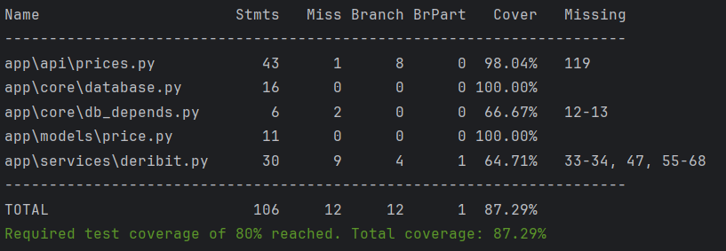

# deribit_parser

deribit_parser — это асинхронный сервис на FastAPI для парсинга цен индексов биржи Deribit и хранения их в PostgreSQL. Приложение позволяет: регулярно (по заданному расписанию) собирать данные о ценах, хранить исторические значения, получать цены через REST API, запускаться в контейнерах (Docker). 

Сервис легко расширяется, в текущей реализации фиксируется index price двух валют, чтобы добавить новую валюту, необходимо добавить необходимую константу в классе CurrencyTicker 


## Design decisions

Этот проект построен с рядом архитектурных решений, призванных обеспечить устойчивость, модульность и тестируемость:

Асинхронный FastAPI - для высокой пропускной способности и комфортной обработки сетевых запросов.

База данных PostgreSQL - стабильное решение для хранения исторических данных, поскольку она хорошо масштабируется, поддерживает индексы, совместима с SQLAlchemy.

SQLAlchemy 2.0 выбрана за полноценную поддержку асинхронности и интеграцию с типизацией.

Celery лучшее решение для периодических задач, поскольку FastAPI не предназначен для cron-задач. Celery + beat — стандартное и устойчивое решение.

Используется асинхронный asyncpg для сервера приложений, sync драйвер psycopg для Alembic.

Разделение слоёв улучшает читаемость, поддержку и тестируемость.


## Структура

```json

.
├── app/
│   ├── main.py                 # FastAPI
│   ├── api/                    # эндпоинты
│   │   ├── prices.py
│   │   └── prices_rout.py        
│   ├── core/
│   │   ├── db_depends.py       # настройки бд
│   │   └── database.py
│   ├── models/
│   │   └── price.py
│   ├── schemas/
│   │   └── price.py
│   ├── services/
│   │   └── deribit.py          # клиент биржи (aiohttp)
│   └── tasks/
│       └── celery_event.py     # Celery task
├── tests/                      # блок тестирования
├── alembic/                    # миграции
├── celery_worker.py
├── docker-compose.yml
├── Dockerfile
├── requirements.txt
├── .env                        # ключи, пароли    
└── README.md

```

# Установка и запуск (локально)
1. Клонирование
```bach
git clone https://github.com/MaminAmetist/deribit_parser.git
cd deribit_parser
```

2. Создание виртуального окружения
```bach
python -m venv .venv
source .venv/bin/activate   # Linux/Mac
.venv\Scripts\activate      # Windows
```

3. Установка зависимостей
```bach
pip install --upgrade pip
pip install -r requirements.txt
```

4. Настройка переменных окружения

Создай .env в корне проекта:

```bash
DATABASE_URL — асинхронный URL PostgreSQL

DATABASE_URL_SYNC — sync URL (для Alembic)
```

## Миграции

Применить миграции:

```bash
alembic upgrade head
```

Если миграции ещё не созданы:

```bash
alembic revision --autogenerate -m "initial"
```

## Запуск сервера
```bash
uvicorn app.main:app --reload
```

## Запуск через Docker
1. Docker Compose

В корне проекта:

2. Запуск
```bash
docker compose up --build
```

## Запуск фоновых задач
```bash
redis redis-server
celery -A app.celery_event.celery_app worker -l info -P solo
celery -A app.celery_event.celery_app beat -l info
```

## API документация

После запуска сервера документация доступна автоматически:

| Swagger UI | http://localhost:8000/docs
 |
| ReDoc | http://localhost:8000/redoc
 |

### REST Endpoints включают в себя следующие методы:

#### Получение всех сохраненных данных по указанной валюте
GET /prices/
Ответ:
[
  {
    "id": 3,
    "ticker": "ETH",
    "price": 3295.48,
    "timestamp": "2026-01-17T09:31:22Z"
  },
  {
    "id": 7,
    "ticker": "ETH",
    "price": 3325.03,
    "timestamp": "2026-01-18T13:48:21Z"
  },
  ...
]

#### Получение последней цены валюты
GET /prices/latest
Ответ:
{
  "id": 246,
  "ticker": "BTC",
  "price": 95038.9,
  "timestamp": "2026-01-18T15:49:22Z"
}

#### Получение цены валюты с фильтром по дате
GET /prices/by_date
Ответ:
[
  {
    "id": 1,
    "ticker": "BTC",
    "price": 95195.5,
    "timestamp": "2026-01-17T09:29:47Z"
  },
  {
    "id": 2,
    "ticker": "BTC",
    "price": 95194.6,
    "timestamp": "2026-01-17T09:30:40Z"
  },
  ...
]

## Тестирование

```bash
pytest --cov=app --cov-report=term --cov-fail-under=80
```
Пример запуска тестов:


